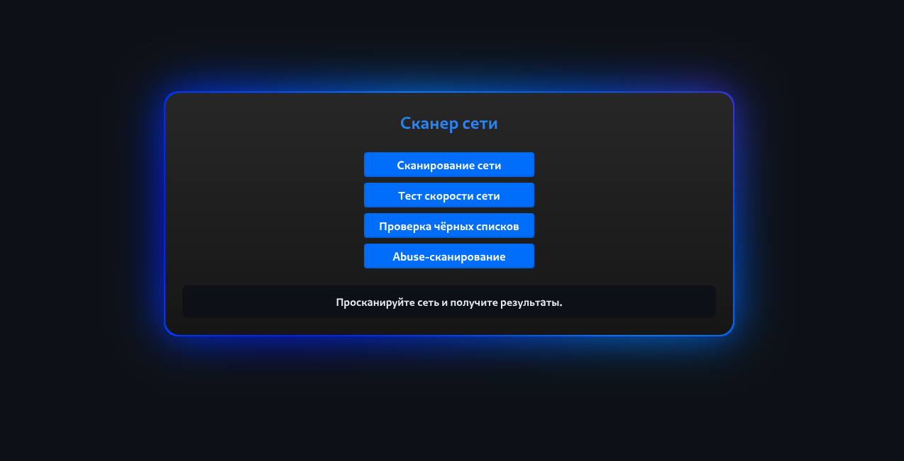

# Network Scanner

A simple Internet scanner with a beautiful dark interface and good functionality.

Fast, easy to use, automatic, asynchronous.

## About The Project

The Network Scanner project was created for simple and fast network scanning. The basis of the project is written in Go (Golang). The project is open source, it can be viewed in NetworkScanner/main/src/.

### Features

* IP Information - Detailed geolocation and network information
* Threat Analysis - Real-time threat level assessment
* Service Availability - Cloudflare, YouTube, Facebook connectivity checks
* Internet Speed Test - Accurate download/upload speed measurement
* Blacklist Monitoring - Check IP across 20+ security databases
* IP Reputation - AbuseIPDB integration for reputation scoring
* Privacy Detection - Tor, VPN, Proxy detection capabilities
* Asynchronous Operations - Fast parallel scanning

### Screenshots


## Warning

Requires Golang 1.24.7+ to be installed from the official https://go.dev/dl/ website

## Quick Start

## Installing dependencies

Go to the NetworkScanner/main directory, then type:

```
go mod download
```

### Launch (Windows/Linux)

Windows:
- Go to NetworkScanner/main/
- Run the file run.exe

Linux (ONLY DEBIAN-BASED):
- Go to NetworkScanner/main/
- Run the file run

## Important for Windows users

This program does not have the **author's signature** and **Microsoft certificates**, so **Microsoft Defender** may block the program, or restrict its permission to use the network, which will cause critical errors in the scanner's operation.

If you have such antiviruses as **Avast**, **Kaspersky**, then they can **remove the program without warning**.

Please, be careful.

## For developers

To edit a project, you need to install:
* Node JS
* npm
* typescript (module)
* Golang

**To change the frontend, go to NetworkScanner/main/src/site, then edit the files index.html, styles.css, script.ts.**

After editing the script.ts you need to update the script.js file, use the command:

```
tsc -p tsconfig.json
```

Your updated script.js will appear in NetworkScanner/main/dist

**To change the backend, go to NetworkScanner/main/src/utilities or NetworkScanner/main/src/server, then edit the Golang files for yourself.**

## License

MIT License - see [LICENSE](LICENSE) file.
